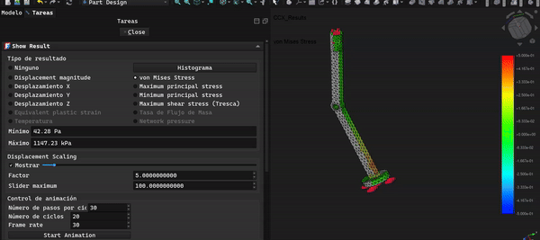
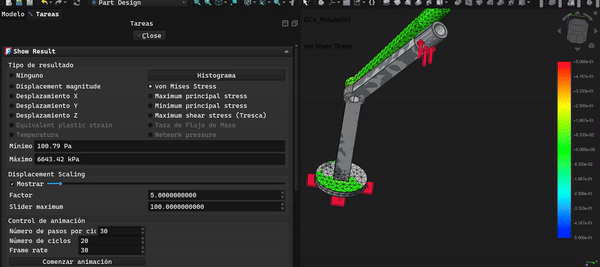

# Pata de Paloma V4 — Prótesis de Miembro Inferior para Columbiformes


**Simulación vertical (2.4 N)**


**Simulación horizontal (2.4 N)**


Prótesis de pie/pierna para palomas (*Columba livia*) con amputación de miembro inferior, diseñada para impresión 3D en PETG y validada mediante análisis de elementos finitos (FEM) con CalculiX.

---

## Descripción

Este proyecto propone una prótesis de una sola pieza imprimible en PETG que replica la geometría funcional del miembro inferior de una paloma doméstica: socket de fijación, tibiotarso, articulación tibiotarsal, tarsometatarso, nervadura estructural y planta del pie.

El diseño está orientado a rehabilitadores de fauna y veterinarios con acceso a impresoras FDM. No requiere ensamble de piezas móviles en su versión completa.

---

## Archivos

```
STL/
├── Fusion004.stl                       — Pieza completa (impresión en una sola vez)
└── partes/
    ├── ExtrusionSocket.stl             — Socket de fijación al muñón
    ├── ExtrusionTibiotarso.stl         — Segmento tibial
    ├── ExtrusionArticulacion.stl       — Articulación tibiotarsal
    ├── ExtrusionTarsometatarso.stl     — Segmento metatarsal
    ├── ExtrusionNervadura.stl          — Nervadura estructural
    └── ExtrusionPlanta.stl             — Planta del pie

FreeCAD/
└── Pata_de_PalomaV4.1.FCStd           — Archivo fuente editable
```

---

## Impresión

| Parámetro | Valor recomendado |
|---|---|
| Material | PETG |
| Relleno | 100% |
| Soporte | No requerido (pieza completa) |
| Temperatura boquilla | 230–240 °C |
| Temperatura cama | 70–80 °C |

---

## Validación estructural (FEM)

Simulación realizada en FreeCAD 1.1.1 + CalculiX. Material: PETG (E = 3150 MPa, Poisson = 0.38). Límite de fluencia de referencia: ~50 MPa.

### Carga vertical (eje Z) — escenario de apoyo normal

| Carga | Von Mises máx | Desplazamiento máx | Factor de seguridad |
|---|---|---|---|
| 0.6 N (reposo) | 0.287 MPa | 0.097 mm | ~174× |
| 2.4 N (carga máx) | 1.15 MPa | 0.39 mm | ~43× |

### Carga lateral (eje X) — escenario de impacto lateral

| Carga | Von Mises máx | Desplazamiento máx | Factor de seguridad |
|---|---|---|---|
| 0.6 N | 1.66 MPa | 0.72 mm | ~30× |
| 2.4 N | 6.64 MPa | 2.86 mm | ~7.5× |

### Carga frontal (eje Y) — escenario de frenado

| Carga | Von Mises máx | Desplazamiento máx | Factor de seguridad |
|---|---|---|---|
| 0.6 N | 1.054 MPa | 0.55 mm | ~47× |
| 2.4 N | 4.22 MPa | 2.20 mm | ~12× |

### Sensibilidad al módulo de Young

| E (MPa) | Von Mises máx | Desplazamiento máx |
|---|---|---|
| 3150 (PETG estándar) | 0.287 MPa | 0.097 mm |
| 2100 (PETG menor calidad) | 0.287 MPa | 0.150 mm |

Los esfuerzos no varían con E (comportamiento elástico lineal esperado). El diseño es robusto ante variación de calidad del filamento.

---

## Mejoras posibles

### Articulación en TPU (no probado)
Es posible sustituir la pieza `ExtrusionArticulacion.stl` por una versión impresa en TPU para mejorar la elasticidad y absorción de impactos en la articulación tibiotarsal. Esta modificación **no ha sido simulada ni probada** por limitaciones computacionales — se incluye como sugerencia para quienes quieran iterar sobre el diseño.

---

## Limitaciones conocidas

- Diseño mono-material (PETG). Una versión multi-material con TPU mejoraría la amortiguación general, pero requiere simulación adicional.
- No incluye dedo posterior (hallux). El diseño se limita a la estructura de apoyo principal.
- No ha sido probado en animales reales. Los resultados FEM son teóricos bajo condiciones estáticas lineales.

---

## Materiales y herramientas utilizadas

- FreeCAD 1.1.1
- CalculiX (solver FEM incluido en FreeCAD)
- PETG como material de referencia

---

## Licencia

[Creative Commons Attribution 4.0 International (CC BY 4.0)](https://creativecommons.org/licenses/by/4.0/)

Puedes usar, modificar y distribuir este diseño libremente con atribución al autor original. Esta licencia aplica a todos los archivos STL y FreeCAD del repositorio.

---

## Apoya el proyecto

Si este proyecto te fue útil, puedes apoyar su desarrollo:

[](https://ko-fi.com/brayanramirez6461)

Este proyecto fue desarrollado con [FreeCAD](https://www.freecad.org/), software libre y de código abierto. Si lo usas, considera apoyar su desarrollo en [freecad.org/donate](https://www.freecad.org/donate.php).

---

## Autor

Brayan ([@brrt2143](https://github.com/brrt2143)) — Ciudad Juárez / Chihuahua, México  
Ingeniería Biomédica
